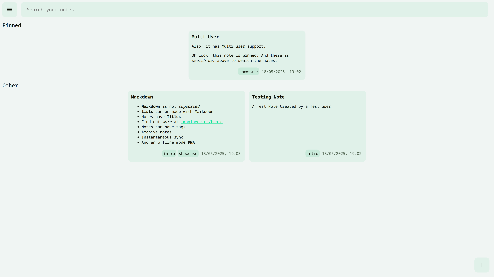

# Bento


A self hosted minimalist multi user note taking service.

> [!WARNING]  
> As of right now, the database (and app) has been tested by me. However, the algorithm for updating and error handling is still rough around the edges. Thus, in this state it is recommended not to use for storing important information without another copy or backups.

### Features

- ✏️ Markdown Notes & preview
- 🫧 Minimal Notes Grid for least friction
- 🗄️ Archiving & Tagging
- 🔎 Search notes
- 📱 Can be installed as a PWA
- 📵 Offline First model, ensuring offline data is merged once online.



## Installation

### Prerequisites

- Node JS
- Postgres Database

### Environment Variables

- `DATABASE_URL`: Postgres Database URL.
- `REGISTRATION`: Set to `false` to disable registration for new user, default is `true`.

### From Source

Make sure to have the latest version of Node and npm installed, also pnpm is recommended over npm
You can also place environment variables in a `.env` file in the root of the project.
1. Clone the this repo
  ```bash
  git clone https://github.com/imagineeeinc/bento.git
  ```
2. Install dependencies
  ```bash
  # npm
  npm i
  # pnpm (recommended)
  pnpm i
  ```

3. Run database migrations
  ```bash
  npx drizzle-kit push
  # Set env "DATABASE_URL" to the Postgres database url.
  ```
4. Generate build
  ```bash
  # npm
  npm run build
  # pnpm
  pnpm build
  ```
6. Run server.
  ```bash
  node build
  ```

### Docker
Make sure to have docker cli installed.
1. Build the image
	```bash
	docker build . -t bento
	```
2. Run. Set the `WEB_PASS` env to a password of your choice. You can also set the used port by setting the `PORT` env.
	```bash
	docker run -p 3000:3000 -e WEB_PASS=Password -d bento
	```
	Access the web app at `localhost:3000`.

## API

There is an API to access the app from without the UI. There is 2 versions of the API.

- `V1` (`/api/v1`): First version with simple get sync and put sync, sending all the changes.
  - `/api/v1/sync`
    - `GET`: Get all notes
    - `POST`: Put all notes, only the changed notes are actually updated
- `V2` (`/api/v2`): [**Work in progress**] Second version with more complex sync, sending only the changed notes.

## License

This project is under the GNU GPL v3 License.
